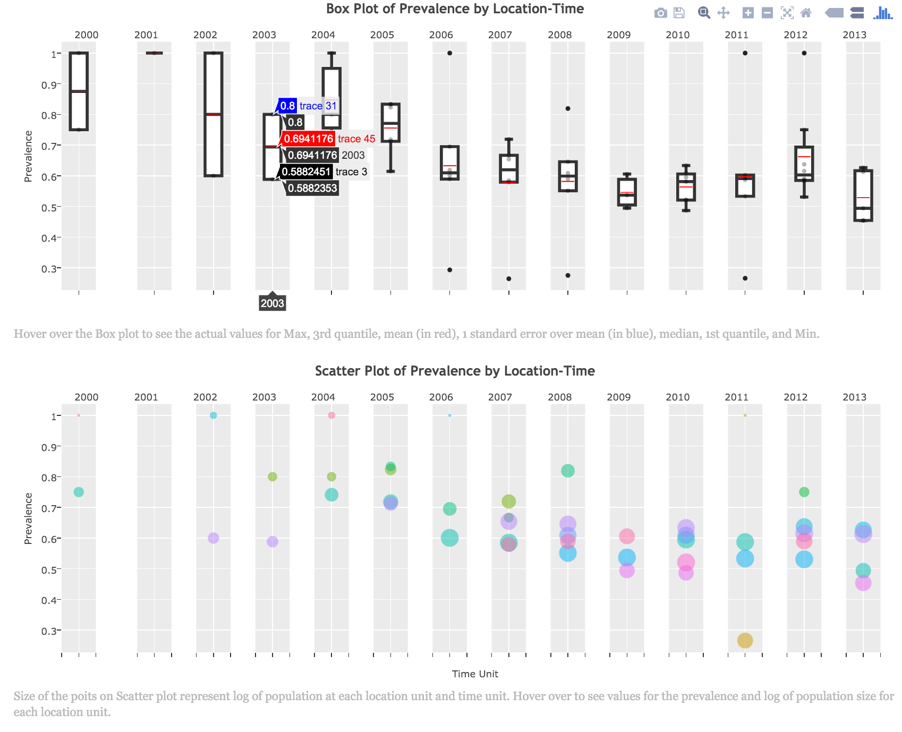
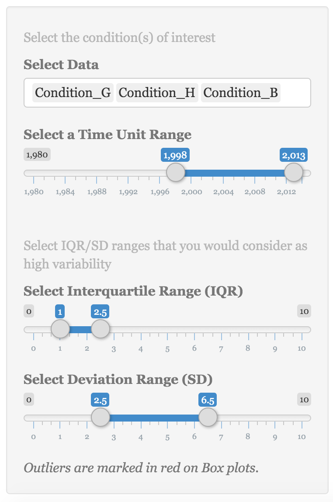
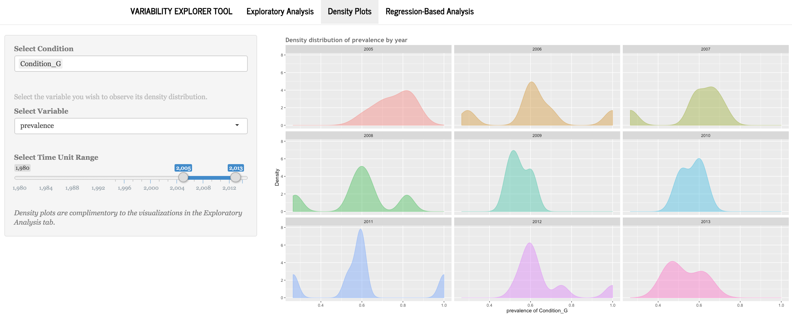
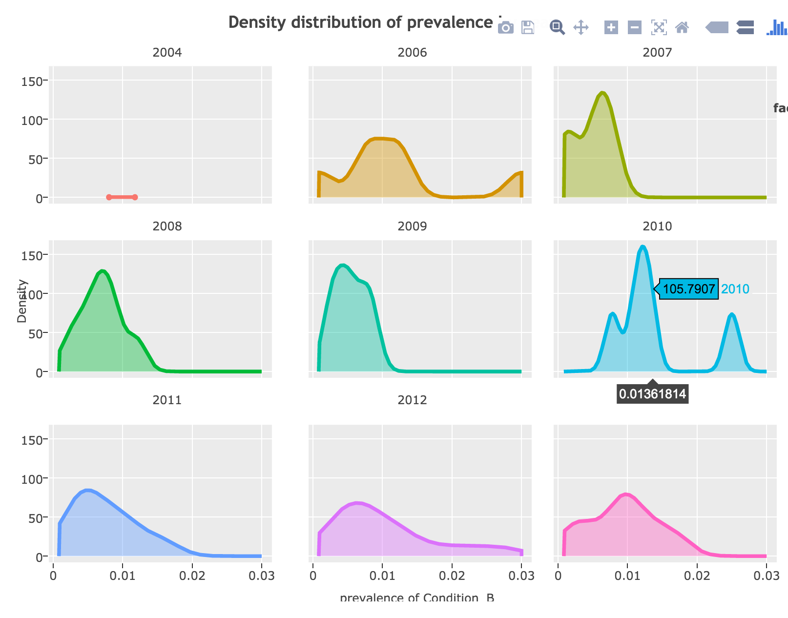
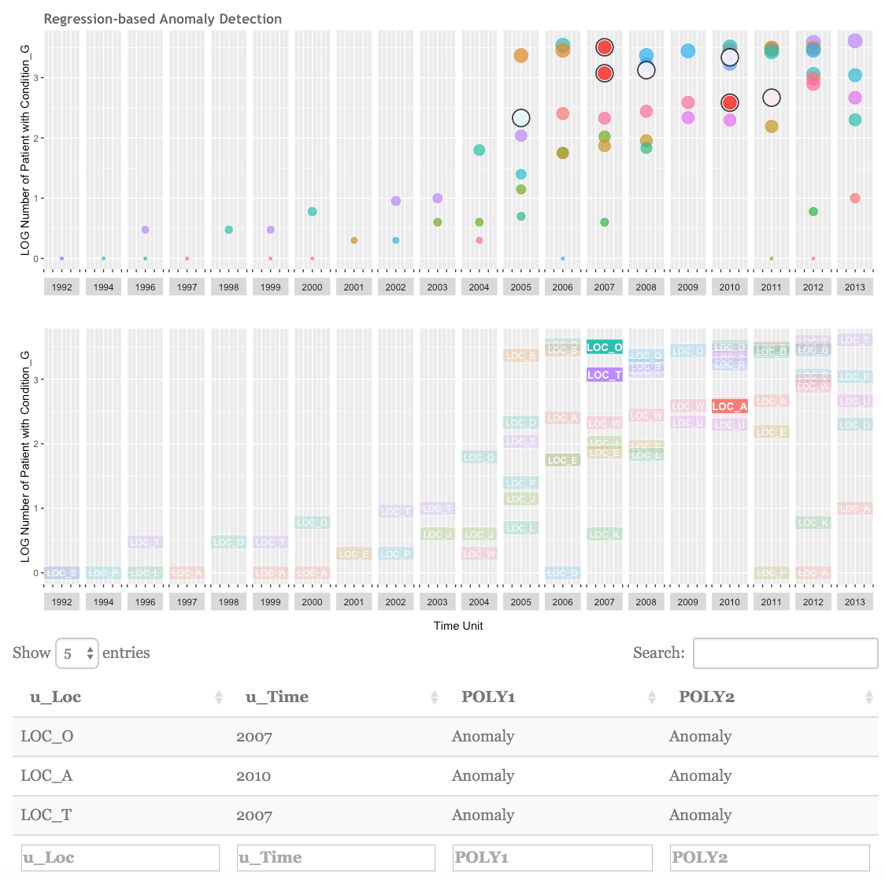

## Introduction to the Application

This application has been built to help researchers (or any other potential data users) explore variability in Electronic Health Record (EHR) data. Multiple statistical procedures exist for detecting anomalies in data. Most of these procedures have been designed for time series data that, by definition, do not match characteristics of patient records stored daily in EHR systems. Other methods to detect variability in data might be considered too “statistical” for the average clinical researchers, and are expected to be conducted at the "study" level – not as an overall view of variability at database/warehouse levels. This tool provides an interactive visual solution to overview of variability in data from two lenses, an "exploratory" view and a "regression-based" view. 

Interactivity is a key attribute to VET's philosophy, through which the tool does not impose a specific point of variability to the users. Instead, the tool is designed to allow the users to explore variability and decide what repercussion might need to be implemented to the data when statistical analysis is going to be conducted.


## Inputs and Outputs
### Preparing and Reading the Data -- `Read.R`
The R script `Read.R` reads the data and feeds it to the application. It uses the `data.table` package to read the input data (via `fread`). All packagews that are being used to run the application are also loaded in `Read.R`. Follow the annotated instructions inside `Read.R` to set the source location and prepare the data for VET. 
```{r, echo=FALSE, cache=FALSE, results= 'hide', include=FALSE}
require(data.table)
## set the source location (for this illustration I have saved the example data on my desktop):
src <- "~/Desktop/testdata.csv"
## read the data from source
srcdt <- fread(src)
```

#### The Data Model
The data model that the tool feeds from consists of three aggregation units (`u_Loc`, `u_Time`, and `U-Cond`), 2 counts (`population`, and `patient`), and a percentage (`prevalence`) that was derived from the 2 counts. The data model is flexible in a sense that the 3 aggregation units can be defined at any spatial level, time scales, and condition of interest. See the data structure bellow:
```{r, echo=FALSE, results='markup', include=TRUE}
## look at data structure
str(srcdt)
```


1. Column `u_Loc` stores the location/spatial unit of analysis as character. Examples of spatial unit are clinic, organization, census tract, and county. 
2. `u_Time`, of type integer, stores the time unit, which can be at any intervals (i.e., hourly, daily, monthly, annual, etc.) as long as the unit is consistent across the dataset.
3. The condition of interest can be stored in `u_Cond` column as character. Condition unit is defined here broadly – it can be a particular subset of the data, a patient cohort, a set of medications or clinical conditions, or the entire data. The application’s interface is designed to automatically read all the unique values stored in `u_Cond` column, so more than one condition can be stored in this column.
4. Column `population` stores the total patient population at location/spatial unit X and time unit Y as integer. 
5. Column ‘patient’ is the subset of total patient population (at location/spatial unit X and time unit Y, as in column `population`) who have condition unit Z, stored as integer. 
6. The proportion of patients with condition Z from the total population at location/spatial unit X and time unit Y is stored in column `prevalence`, as integer or number – divide `patient` by `population`.
 

The `Read.R` adds a new column to this data model where it copies the `u_Time` variable as factor that will be used later by the app to generate two of the plots. For illustration purposes, an example dataset `database.csv` is provided. Output of the `Read.R` is the source dataset, `srcdt`, which feeds all application functions in `app.R`. 

## Running the Application
Once the `Read.R` is set up for the first time, it is not necessary to open it again. To run the application, run all codes in `app.R`, which first sources `Read.R`. All coding to process data, run the analyses, and generate plots lives in `app.R`. Code chunks in `app.R` prepare the data for the User Interface (UI), set up the UI, setu up the server and associated plots, and finally run the application using `shinyApp(ui, server)`. 

### UI and Server Data
The application uses *navbarPage* format for the Shiny app -- [learn more here][link1]. `app.R` processes source data `srcdt` that has been read into R by `Read.R` to produce data for the UI (`datUI`) and reactive data (`dat` and `datREG`) for server. The application uses `datUI` to read in the unique condition units, `u_Cond`, from the source data and automatically fill in the *Select Data* option on the left. Since "too old" EHR data are currently often not reliable, the data on UI panel is limited to years after 1980.

Through data processing, the code adds two new columns to the source data prepared for the server (`dat`), where it stores two ratio indices for Interquartile Range and Standard Deviation, which will then be used for the **Exploratory Analysis** tab.

* Interquartile Range Ratio. Column `iqr` stores the ratio of interquartile range for each time unit (`u_Time`), calculated from the interquartile range of each time unit divided by the mean interquartile range over all time units.
* Standard Deviation Ratio. Column `std` stores the ratio of standard deviation for each time unit (`u_Time`), calculated from the within time unit standard deviation divided by the mean standard deviation over all time units.

Using the two indices, `iqr` and `std`, users can interactively highlight time units where the two values are significantly above the overall patterns.

## TABS (Change the heading)
### The Variability Preview Tab
The **Variability Preview** tab provides a dynamic interactive overview of the data through a Box plot, which is a conventional plot for looking at variability, and a Scatter plot (Figure 1), using `ggplot` and `plotly` packages in R -- all graphics are produced using `ggplot`, and all dynamic graphics are enhanced with `plotly`.The Y axis in both plots represent the prevalence for the selected condition, and the X axes show the selected time unit. There are additional information embedded in the Box plots. By hovering over the Box plot the user can see the actual values for maximum, third quantile, one standard error above mean (in blue), mean value (in red), median, first quantile, and minimum of prevalence across location units and at each time unit.

In addition to the prevalence value at different location units, the size of point on the Scatter plot represent log of population at each unit location and time. That is, the user can view prevalence value in light of how big or small population at each location unit is.


Figure 1. The Variability Preview Tab

### The Exploratory Analysis Tab
The **Exploratory Analysis** tab provides four visualizations for the user to explore potential variability (or lack thereof) in the data. On the left-hand side meneu, the user can select a unit condition (or a set of conditions) from column `u_Cond` in the source data. The UI automatically recognizes and lists unqiue values in `u_Cond`. The user can also select a time unit range to zoom in on a particular time period or zoom out to see the overall trend. These settings feed the necessary data to generate the four visualizations for exploring variability (Figure 1). 



Figure 1. The Exploratory Analysis Tab's Menu Bar

The X axis on all four graphics is the time unit, `u_Time`, whereas the Y uses prevalence of the condition of interest (`u_Cond`) within the selected time period.

#### Prevalence Box Plots
The first two graphics in this tab (Prevalence by Location-Time) are ordinary Box plots of the `prevalence` variable, which show distribution of prevalence (i.e., patient divided by population) of the selected condition among units of locations across the selected time period. A scatter plot with jittered data points are also overlayed in the background. Box plots at any specific time unit illustrate maximum, minimum, first and third quartiles, and median for the prevalence of the selected unit condition. In the example dataset, unit of time is year. The two graphics show variations in annual prevalence of conditions E and A between years 1999 and 2014. Box plots are conventionally used to visualize variability. However, to add more to these plots, users can highlight time units in which Interquartile Range (first plot) and Standard Deviation (second plot) are within a certain range. This interactive function allows users to highlight particular time units that have higher Interquartile Range or Standard Deviation than the average over the selected time period. In figure 1, for example, years in which Interquartile Range and Standard Deviation for conditions E and A are between one to 6 times more than the average Interquartile Range and Standard Deviation within 1999 and 2014 are highlighted. A continous color spectrum from gold to red is dynamically assigned to the minimum and maximum of selected ranges for better visual presentation of variability.



Figure 2. The Exploratory Analysis Tab's Plots

#### Scatter Plots
Two scatter plots complement information provided by Box plots. Plot number three (Prevalence Over Time) adds a smoothed regression line with confidence intervals to the scatter plot of prevalence over time unit. The regression line illustrates the overall variability pattern. The confidence interval visually represents data points across time units, helping the users make a more informed decision about variability conveyed through the Box plots. 

Last plot, Overall Patient Population Over Time, is a scater plot of the overall population within location units (e.g., primary care clinics), regardless of condition unit. This plot illustrates the changing pattern in population seen at location units within the selected time units. For example, in Figure 1, high variability between years 2001 and 2005 can be related to the relatively smaller population size across location units within those years.
  
## The Density Plots
 
To complement the visualizations provided in **Exploratory Analysis**, the **Density Plots** tab displays smoothed probability density function of `prevalence` variable for the selected condition and time range (Figure 2). Density plots show changes in distribution of 


Figure 3. The Exploratory Analysis Tab


## Regression-based Analysis
"By default, with raw = FALSE, poly() computes an orthogonal polynomial. It internally sets up the model matrix with the raw coding x, x^2, x^3, ... first and then scales the columns so that each column is orthogonal to the previous ones. This does not change the fitted values but has the advantage that you can see whether a certain order in the polynomial significantly improves the regression over the lower orders."



Figure 4. The Exploratory Analysis Tab


[link1]: http://shiny.rstudio.com/reference/shiny/latest/navbarPage.html "learn about navbarPage"

