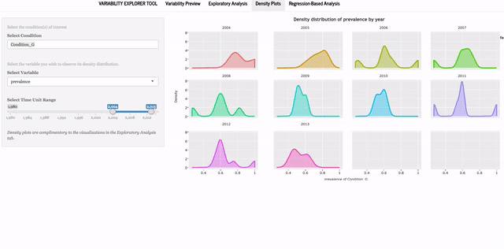
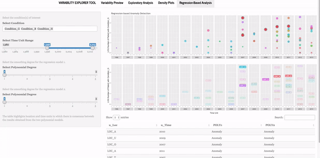

## Introduction to the Application

This application has been built to help researchers (or any other potential data users) explore variability in Electronic Health Record (EHR) data. Multiple statistical procedures exist for detecting anomalies in data. Most of these procedures have been designed for time series data that, by definition, do not match characteristics of patient records stored daily in EHR systems. Other methods to detect variability in data might be considered too “statistical” for the average clinical researchers, and are expected to be conducted at the "study" level – not as an overall view of variability at database/warehouse levels. This tool provides an interactive visual solution to overview of variability in data from two lenses, an "exploratory" view and a "regression-based" view. 

Interactivity is a key attribute to VET's philosophy, through which the tool does not impose a specific point of variability to the users. Instead, the tool is designed to allow the users to explore variability and decide what repercussion might need to be implemented to the data when statistical analysis is going to be conducted.


## Inputs and Outputs
### Preparing and Reading the Data -- `Read.R`
The R script `Read.R` reads the data and feeds it to the application. It uses the `data.table` package to read the input data (via `fread`). All packagews that are being used to run the application are also loaded in `Read.R`. Follow the annotated instructions inside `Read.R` to set the source location and prepare the data for VET. 
```{r, echo=FALSE, cache=FALSE, results= 'hide', include=FALSE}
require(data.table)
## set the source location (for this illustration I have saved the example data on my desktop):
src <- "testdata.csv"
## read the data from source
srcdt <- fread(src)
```

#### The Data Model
The data model that the tool feeds from consists of three aggregation units (`u_Loc`, `u_Time`, and `U-Cond`), 2 counts (`population`, and `patient`), and a percentage (`prevalence`) that was derived from the 2 counts. The data model is flexible in a sense that the 3 aggregation units can be defined at any spatial level, time scales, and condition of interest. See the data structure bellow:
```{r, echo=FALSE, results='markup', include=TRUE}
## look at data structure
str(srcdt)
```


1. Column `u_Loc` stores the location/spatial unit of analysis as character. Examples of spatial unit are clinic, organization, census tract, and county. 
2. `u_Time`, of type integer, stores the time unit, which can be at any intervals (i.e., hourly, daily, monthly, annual, etc.) as long as the unit is consistent across the dataset.
3. The condition of interest can be stored in `u_Cond` column as character. Condition unit is defined here broadly – it can be a particular subset of the data, a patient cohort, a set of medications or clinical conditions, or the entire data. The application’s interface is designed to automatically read all the unique values stored in `u_Cond` column, so more than one condition can be stored in this column.
4. Column `population` stores the total patient population at location/spatial unit X and time unit Y as integer. 
5. Column ‘patient’ is the subset of total patient population (at location/spatial unit X and time unit Y, as in column `population`) who have condition unit Z, stored as integer. 
6. The proportion of patients with condition Z from the total population at location/spatial unit X and time unit Y is stored in column `prevalence`, as integer or number – divide `patient` by `population`.
 

The `Read.R` adds a new column to this data model where it copies the `u_Time` variable as factor that will be used later by the app to generate two of the plots. For illustration purposes, an example dataset `database.csv` is provided. Output of the `Read.R` is the source dataset, `srcdt`, which feeds all application functions in `app.R`. 

## Running the Application
Once the `Read.R` is set up for the first time, it is not necessary to open it again. To run the application, run all codes in `app.R`, which first sources `Read.R`. All coding to process data, run the analyses, and generate plots lives in `app.R`. Code chunks in `app.R` prepare the data for the User Interface (UI), set up the UI, setu up the server and associated plots, and finally run the application using `shinyApp(ui, server)`. 

### UI and Server Data
The application uses *navbarPage* format for the Shiny app -- [learn more here][link1]. `app.R` processes source data `srcdt` that has been read into R by `Read.R` to produce data for the UI (`datUI`) and reactive data (`dat` and `datREG`) for server. The application uses `datUI` to read in the unique condition units, `u_Cond`, from the source data and automatically fill in the *Select Data* option on the left. Since "too old" EHR data are currently often not reliable, the data on UI panel is limited to years after 1980.

Through data processing, the code adds two new columns to the source data prepared for the server (`dat`), where it stores two ratio indices for Interquartile Range and Standard Deviation, which will then be used for the **Exploratory Analysis** tab.

* Interquartile Range Ratio. Column `iqr` stores the ratio of interquartile range for each time unit (`u_Time`), calculated from the interquartile range of each time unit divided by the mean interquartile range over all time units.
* Standard Deviation Ratio. Column `std` stores the ratio of standard deviation for each time unit (`u_Time`), calculated from the within time unit standard deviation divided by the mean standard deviation over all time units.

Using the two indices, `iqr` and `std`, users can interactively highlight time units where the two values are significantly above the overall patterns.

##Understanding the Outputs
The tool produces a web-based interface with four tabs. Together, the first three tabs (`Variability Preview`, `Exploratory Analysis`, and `Density Plots`) provide different visual representations of the data to the users to explore variability from their own point of view. The `Regression-based Analysis` tab uses polynomial regression modeling to identify possible anomalies, and therefore takes a user-defined approach to identifying variability for the user. All graphics in these outputs were produced using ggplot2 package version 2.0.0, and all dynamic graphics are enhanced with plotly package version 2.0.16.
Below we explain the four tabs provided by DQe-v with snapshots of the output for each tab that were generated using the example data that comes with the tool. It is important for the reader/user to keep in mind that the outputs we use in this paper are for illustration purpose and were generated for different conditions and time units – as a result, what we interpretation from the output of a given tab may not be exactly extended to the outputs and interpretations of other tabs.


### The Variability Preview Tab
The **Variability Preview** tab provides a dynamic interactive overview of the data through a Box plot, which is a conventional plot for looking at variability, and a Scatter plot (Figure 1), using `ggplot` and `plotly` packages in R -- all graphics are produced using `ggplot`, and all dynamic graphics are enhanced with `plotly`.The Y axis in both plots represent the prevalence for the selected condition, and the X axes show the selected time unit. There are additional information embedded in the Box plots. By hovering over the Box plot the user can see the actual values for maximum, third quantile, one standard error above mean (in blue), mean value (in red), median, first quantile, and minimum of prevalence across location units and at each time unit.

In addition to the prevalence value at different location units, the size of point on the Scatter plot represent log of population at each unit location and time. That is, the user can view prevalence value in light of how big or small population at each location unit is.


Figure 1. The Variability Preview Tab

Because boxplots give an excellent sense of the spread of a statistic, but no indication of the size of the population depicted, the Scatter plot is included to cure this deficiency.  The dots plotted are median prevalence values from each source data warehouse, and are sized proportional to population (on a log scale). Thus, the user can view prevalence value in light of how big or small population at each location unit is. 
For example, in Figure 1, the Box Plot shows that within-location variability in prevalence of the selected condition between years 2000 and 2004 (except for year 2001) seems to be relatively higher than variability after year 2004. The Scatter Plot reveals that there were only two to three data points (data from two to three locations) is available in between years 2000 and 2004. Also those two to three locations have a relatively small population size compared to the years after 2004. Altogether, in this example, the two plots in this tab raise concern about reliability of data from before 2004.


### The Exploratory Analysis Tab
The **Exploratory Analysis** tab provides four visualizations for the user to explore potential variability (or lack thereof) in the data. On the left-hand side menu, the user can select one or more conditions to view. The UI automatically recognizes and lists unique values in `u_Cond`. The user can also select a time unit range to zoom in on a particular time period or zoom out to see the overall trend. These settings feed the necessary data to generate the four visualizations for exploring variability (Figure 2).


Figure 2. The Exploratory Analysis Tab's Menu Bar

Figure 3 illustrates the plots generated in this tab, with data from the provided example dataset. Here again the X axes on all four graphics is the time unit and Y axes are prevalence.

#### Prevalence Box Plots
The first two graphics in this tab (Prevalence by Location-Time) are ordinary Box plots of the prevalence variable, which show distribution of prevalence (i.e., patient divided by population) of the selected condition among units of locations across the selected time period. A scatter plot with jittered data points are also overlaid in the background. Box plots at any specific time unit illustrate maximum, minimum, first and third quartiles, and median for the prevalence of the selected unit condition. In the example dataset, the unit of time is year, but time interval can be set at any uniform time interval by the user. The two graphics show variations in the annual prevalence of conditions G, H, and B between years 1998 and 2013. Box plots are conventionally used to visualize variability. However, to add more to these plots, users can highlight time units in which Interquartile Range (first plot) and Standard Deviation (second plot) are within a certain range. 
The interactivity allows users to highlight particular time units that have higher Interquartile Range or Standard Deviation than the average over the selected time period. A continuous color spectrum from gold to red is dynamically assigned to the minimum and maximum of selected ranges for better visual presentation of variability.


Figure 3. The Exploratory Analysis Tab's Plots

In figure 3, for example, years in which Interquartile Range and Standard Deviation for conditions G, H, and B are between one to two and half times more than the average Interquartile Range (IQR) and between two and half and six and half times more than the average Standard Deviation (STD) within 1998 and 2013 are highlighted. With these IQR and STD settings, in this example, the user can see in the box plots that six and eight time units are respectively highlighted as time units with high variability. As the figure shows, it is possible that some time units with low Interquartile Range ratio have high Standard Deviation ratio, and vice versa, due to the spread of data points and outliers. For this reason, this tab provides the user with the ability to consider both indices in his/her exploration of data variability.


#### Scatter Plots Tab
Two scatter plots complement information provided by Box plots. Plot number three (Prevalence Over Time) adds a smoothed regression line with confidence intervals to the scatter plot of prevalence over time unit. The regression line illustrates the overall variability pattern. The confidence interval visually represents data points across time units, helping the users make a more informed decision about variability conveyed through the Box plots.

Last plot, Overall Patient Population Over Time, is a Scatter plot of the overall population within location units (e.g., primary care clinics), regardless of condition unit. This plot illustrates the changing pattern in population seen at location units within the selected time units. For example, in Figure 3, high variability between years 2000 and 2005 (highlighted with a yellow box) can be related to the relatively smaller population size across location units.

  
### The Density Plots Tab
 
To complement the visualizations provided with the two preceding tabs, the **Density Plots** tab displays smoothed probability density function of a user-selected variable for a selected condition and time range. The menu bar in this tab allows the users to look at changes in distribution of their variable of interest, be it prevalence, patient, or population. Allowing the user to change the variable of interest to provide a more holistic preview of data distribution. Figure 4 illustrates annual probability distribution functions for `Condition_B` between years 2004 and 2013.


Figure 4. Visualization of probability density functions in Density Plots Tab

The X axis in each plot represents the selected variable from the UI and the Y axis represents density. This tab is especially useful to learn about distribution of data over time and to identify time units with abnormal distribution patterns. In the example used for Figure 4, we selected prevalence as the variable of interest between years 2004 and 2013. According to the figure, distribution of prevalence values is for the most part skewed to the left. In 2004, there is only two data points – a probability density function is not possible to estimate. Also, in 2010, the plot shows that there two peaks in the observed `Prevalence` value.

Figure 5 presents an animated graphic on how the **Density Plot** tab works.


Figure 5. Animated graphic of Density Plots tab


## Regression-based Analysis
The **Regression-based Analysis** tab uses predictive analytics to detect data points (i.e., single observations within a given unit of condition, time, and location) that are statistically aberrant given the data observed in preceding and proceeding time units. These data points are marked as anomalous and displayed on two visualizations. Calculation of expected values are based on a series of raw polynomial regression models that predict prevalence based on time unit and population for each location units, using the function `poly()` in R. The regression function internally sets up the model matrix with the raw coding x, x^2, ..., x^p, when x is the variable of interest and p is the degree of the polynomial regression, which can be defined by the user.
Accordingly, the two regression models are estimated using the following function:
 

Accordingly, the regression models are estimated using the following function:
$$ θ = β_1 \sum_{i=1}^p u Time^i + β_1 \sum_{j=1}^p population^j$$

where p is the degree of polynomial regression and  is the estimated value for the prevalence given all other data points provided for a unit of condition.

The tool uses polynomial regression as a smoothing mechanism. That is, the users can set up the smoothing degree in the UI (maximum has been set to 5) and compare the difference in anomalies detected via two user-defined smoother polynomial lines. As illustrated in Figure 6, the regression based analysis produces three outputs: two plots and a consensus table. 
 


Figure 6. Output of the Regression-based Analysis

The first plot from the top is a scatter plot of log of number of patients with the selected condition (i.e., patient) at each unit location and time. Dots are color coded by unit location, and similar to the scatter plot in Figure 1, sized proportional to the log of total population at each clinic and time unit. On top of the prevalence scatter plot location units that have been detected as anomalous using polynomial regression estimates are highlighted. White dots with a black stroke line are anomalies detected with the first set of polynomial regression models (where the actual prevalence value at location x and time y is statistically different from the estimated values given all data points for location x within the selected time unit range). Red dots on top of white dots show anomalies detected with second set of polynomial regression models. The default is set to one, so that red dots overlap the white dots. Once the user increases the polynomial degrees for the first and second model (i.e., moves towards smoother regression lines), fewer red dots are expected. The second plot, which has the same x and y axes as the first plot, only highlights the location names detected as anomalous with the second polynomial models, as a reference. The data table shows the time and location units where the outcomes of the two models are in consensus. This interactivity enables the users to apply different smoothing scenarios and see how anomaly identification may differ based on the defined models – model selection can vary from Ordinary Least Square (OLS) to a five-degree polynomials.
In the example illustrated in Figure 5, the plot on top has identified seven data points as anomalous by model number one – using an OLS algorithm (polynomial with degree set to one). Three of these data points are also identified as anomalies by the second model – a degree two polynomial regression algorithm. The second plot has highlighted the location id `u_Loc` for the three data points – i.e., it shows that `LOC_T` and `LOC_O` in year 2007 and `LOC_A` in year 2010 are anomalies. As the two models agree on these three data points as anomalies, the table underneath the plots has illustrated them as anomalies. 

Figure 7 shows how the Regression-based Analysis tab works.



Figure 7. Animated graphic of the Regression-based Analysis tab

 


[link1]: http://shiny.rstudio.com/reference/shiny/latest/navbarPage.html "learn about navbarPage."

